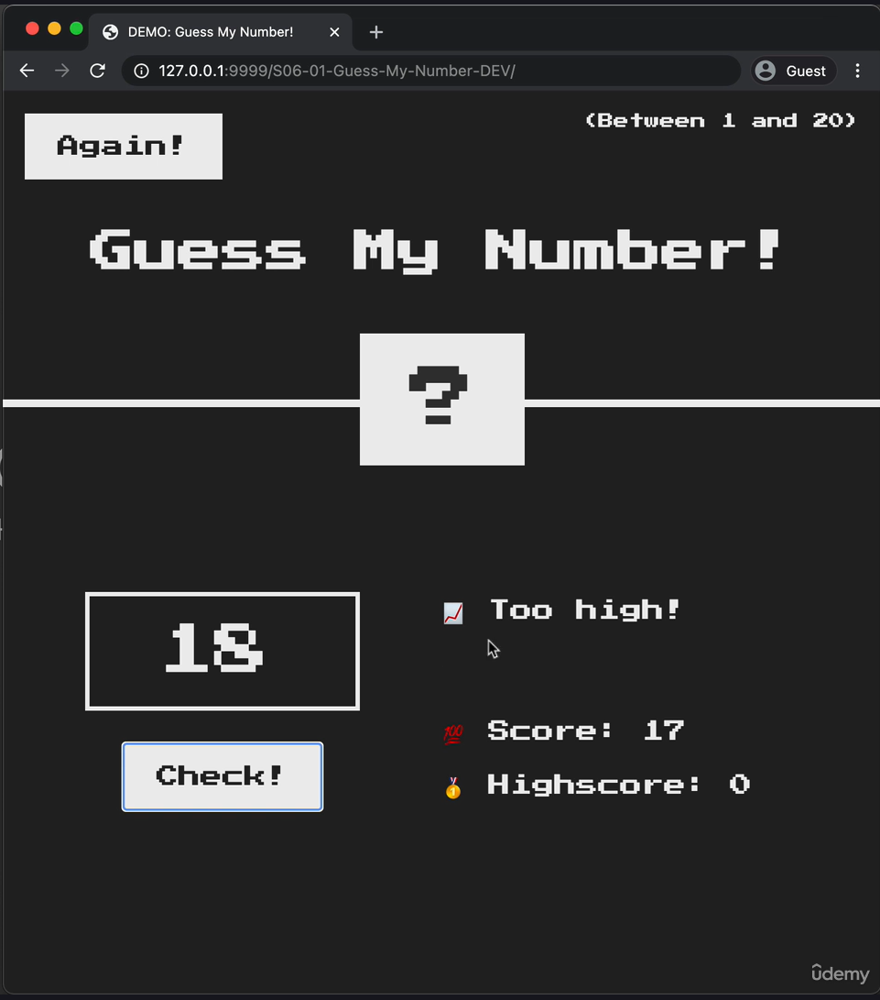

# 🎯 Guess The Number - JavaScript Game

A simple and interactive number guessing game built using HTML, CSS, and JavaScript.

## 🚀 Features

- Random number between 1 and 100  
- Score tracking  
- Input validation and feedback  
- Restart option  

## 🛠️ Technologies Used

- HTML  
- CSS  
- JavaScript

## 📸 Screenshot

To insert an image in Markdown:


 


## 📂 Project Structure

```
guess-number-js/
├── index.html
├── style.css
├── script.js
├── README.md
 screenshot.png
```

## 🧠 How to Play

1. Enter a number between 1 and 100.
2. Click "Check" to submit your guess.
3. Get feedback whether your guess is too high, too low, or correct.
4. Click "Again" to play a new round.

## 👤 Author

**Saai Krahaanth**

## 📝 License

This project is open source and free to use.
