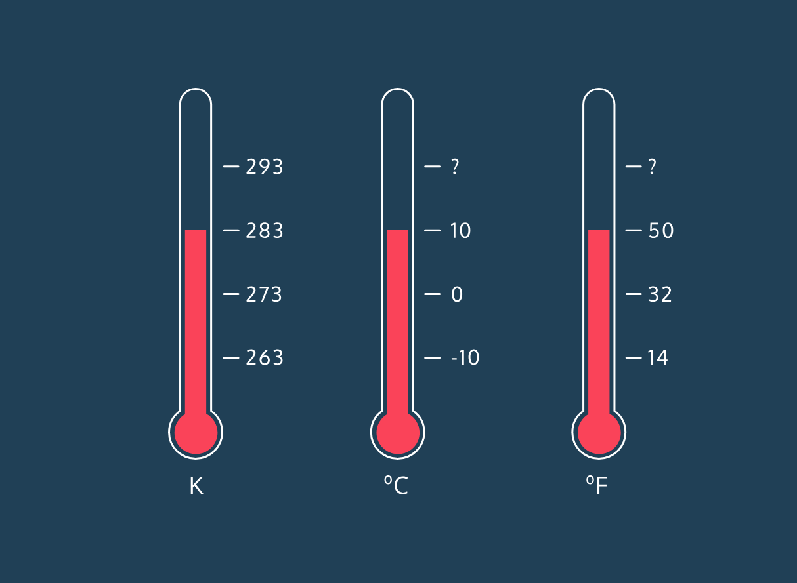

# **Kelvin Weather Converter**  

## **Overview**  
Kelvin is a temperature scale commonly used in scientific applications. However, most people are more familiar with Celsius and Fahrenheit. In this project, we will **convert Kelvin to Celsius and Fahrenheit** using JavaScript.  

## **Formulae for Conversion**  
1. **Celsius = Kelvin - 273**  
2. **Fahrenheit = (Celsius × 9/5) + 32**  



## **Steps**  
1. Define a **constant** Kelvin temperature.  
2. Convert Kelvin to Celsius.  
3. Convert Celsius to Fahrenheit.  
4. Round down the Fahrenheit value.  
5. Print the results.  

## **Code Implementation**  
```javascript
// Define Kelvin temperature
const kelvin = 283;

// Convert Kelvin to Celsius
const celsius = kelvin - 273;

// Convert Celsius to Fahrenheit
let fahrenheit = celsius * (9 / 5) + 32;

// Round down the Fahrenheit value
fahrenheit = Math.floor(fahrenheit);

// Print results
console.log(`The temperature is ${fahrenheit}° Fahrenheit.`);
```

## **Expected Output**  
For `kelvin = 283`, the output will be:  
```
The temperature is 50° Fahrenheit.
```

## **Key Concepts Learned**  
✔ Variables and constants (`const` and `let`)  
✔ Arithmetic operations  
✔ Temperature conversions  
✔ Using `Math.floor()` to round numbers  
✔ String interpolation with template literals  

This simple JavaScript program helps in understanding temperature conversion and fundamental JavaScript concepts. 🚀